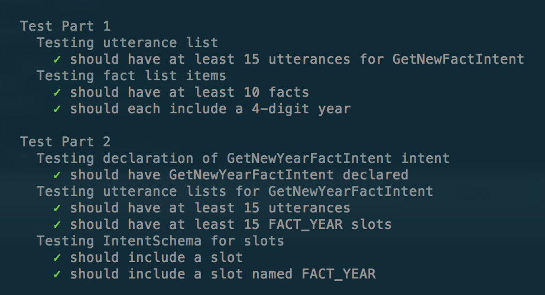

# Tasks
This skill consists of two parts:

1. Expand history fact skills set
2. Add a feature by creating a new intent with built-in slot

## Part 1: Expand history facts skills
**Tasks:**

1. Choose a history category you wish to use for your skill. We're going to use Alexa sample skill template from [History Facts](https://github.com/alexa/skill-sample-nodejs-fact) GitHub repo.
2. Expand the sample utterances in the starter code `src/models/en-US.json` file to include at least 15 appropriate samples/utterances for `GetNewFactIntent`. Examples can be found [here](https://github.com/alexa/skill-sample-nodejs-fact/blob/en-US/models/en-US.json).
3. Expand the facts list at the top of the `src/lambda/index.js` file such that there are at least 10 distinct facts, where each includes a 4-digit year in its text. These will be spoken by the Amazon Text-To-Speech algorithm (TTS), so keep in mind where you wish pauses to occur. To hear how it sounds, enter your sentence in the developer portal under the “Test” section.
4. Test it! All “Part 1” local unit tests should pass. In the next lesson, you'll try the skill out by uploading your changes to the Interactive model in the Developer Portal and AWS Lambda.

## Part 2: Add a feature by creating a new intent with built-in slot
In addition to the `GetNewFactIntent` intent already included in Part 1, add a new [intent](https://developer.amazon.com/docs/custom-skills/create-the-interaction-model-for-your-skill.html#intents-and-slots) including a built-in slot that will provide the user with a fact matching the year requested. You can name this new intent `GetNewYearFactIntent` and build-in slot named `FACT_YEAR`.

*Built-in Amazon slots can be used for the fact year. Consider using AMAZON.FOUR_DIGIT_NUMBER for this purpose. This is not required, however, if you prefer to try a different slot definition.*

**Tasks:**

1. Provide at least 15 utterances for the new GetNewYearFactIntent intent.
2. Complete the TODO’s in `src/lambda/index.js` file to implement a Lambda function handler for `GetNewYearFactIntent` that will provide a fact for the specific year requested and provide a random fact if the year is not found in the fact list. You can use GetNewFactHandler as a template.
3. Test it! All “Part 2” local unit tests should pass.

From the terminal, run `npm test` inside the `src` directory to check your passing tests.

